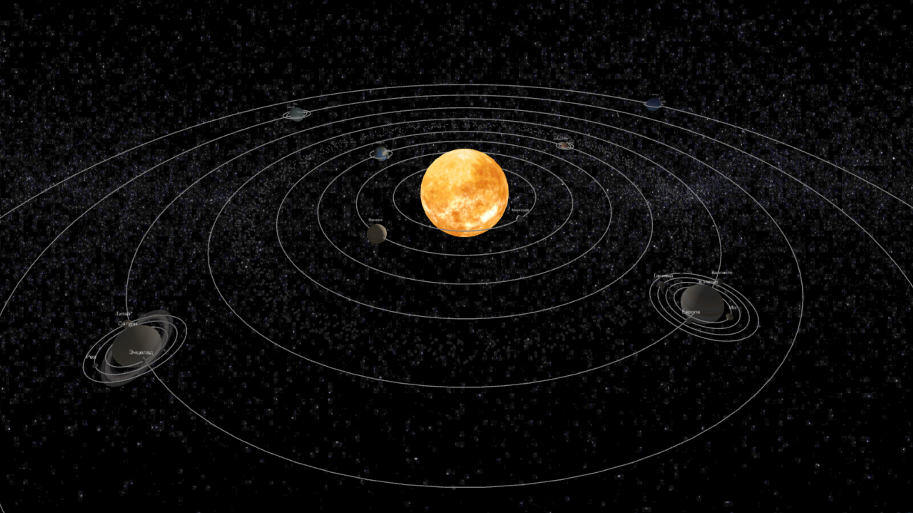

# Визуализация солнечной системы

Этот проект создает 3D-визуализацию Солнечной системы с использованием [Three.js](https://threejs.org/), где отображаются небесные тела, такие как Солнце, планеты, луны и астероидный пояс. Вы можете взаимодействовать с сценой, используя управление мышью для зума, панорамирования и поворота.

## Особенности

- Реалистичные текстуры небесных тел
- Анимации вращения и движения по орбите
- Симуляция астероидного пояса
- Интерактивная сцена с управлением мышью

## Настройка

Вы можете настроить параметры небесных тел (такие как размер, текстура и скорость вращения) в файле `planet-params.ts`

## Лицензия

Этот проект распространяется под лицензией [MIT](https://opensource.org/licenses/MIT).
